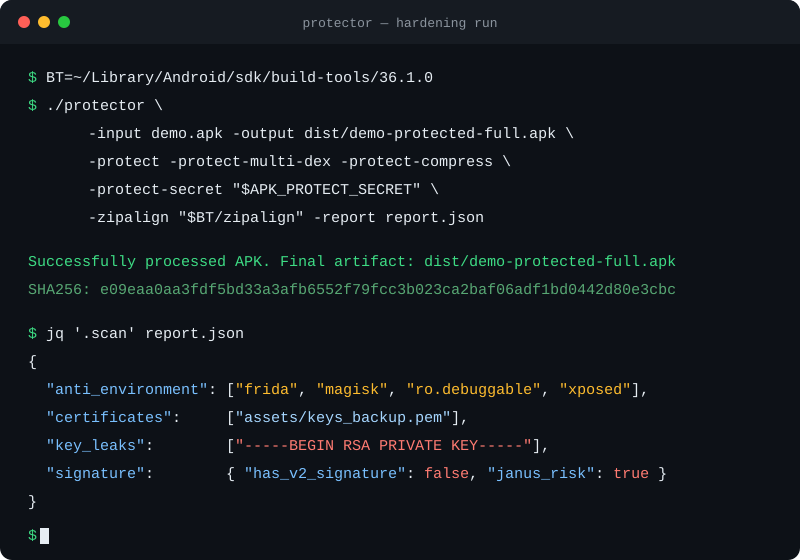
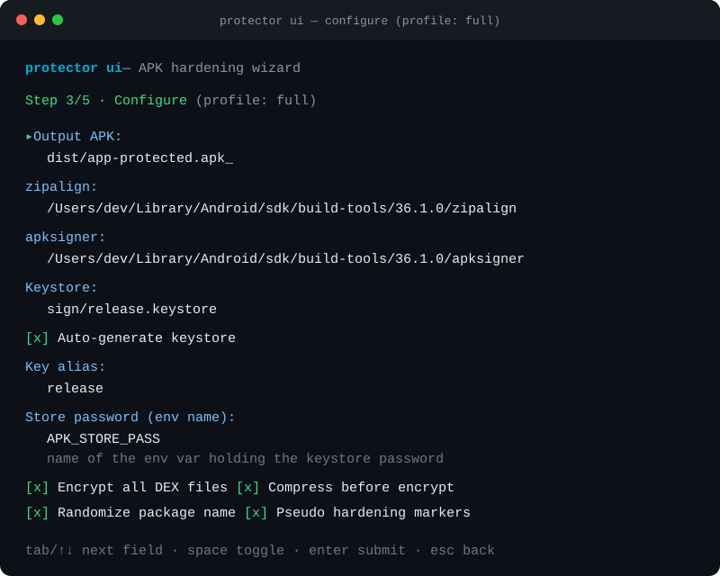

<h1 align="center">Apk-Protector-Tool</h1>

<p align="center">
  
</p>

<p align="center">
  <strong>Local-first APK hardening &amp; LLVM IR obfuscation toolkit, written in Go.</strong><br/>
  Harden, scan, align and sign Android releases — entirely on your machine, no clouds, no uploads.
</p>

<p align="center">
  <a href="https://github.com/Ero-Cat/Apk-Protector-Tool/actions/workflows/ci.yml"></a>
  <a href="https://github.com/Ero-Cat/Apk-Protector-Tool/releases"></a>
  <a href="https://go.dev/"></a>
  <a href="https://goreportcard.com/report/github.com/Ero-Cat/Apk-Protector-Tool"></a>
  <a href="LICENSE"></a>
</p>

<p align="center">
  🇨🇳 <a href="README_zh-CN.md">中文文档</a>&nbsp;&nbsp;·&nbsp;&nbsp;🗺
  <a href="docs/ROADMAP.md">Roadmap</a>&nbsp;&nbsp;·&nbsp;&nbsp;🎨
  <a href="docs/design/tui-evaluation.md">TUI design</a>&nbsp;&nbsp;·&nbsp;&nbsp;🐛
  <a href="https://github.com/Ero-Cat/Apk-Protector-Tool/issues">Report a bug</a>
</p>

> 💡 Like this project? Please consider giving it a ⭐ — it helps others find it!

---

## 📋 Table of Contents

- [⚠️ Disclaimer](#️-disclaimer)
- [🚀 Quickstart](#-quickstart)
- [🎬 Demo](#-demo)
- [✨ Features](#-features)
- [📖 Usage Manual](#-usage-manual)
  - [protector — APK hardening CLI](#protector--apk-hardening-cli)
  - [goprotect — IR obfuscation CLI](#goprotect--ir-obfuscation-cli)
  - [Configuration files](#configuration-files)
  - [Runtime integration](#runtime-integration)
- [🧠 Philosophy — why another protector?](#-philosophy--why-another-protector)
- [🗺 Roadmap](#-roadmap)
- [❓ FAQ](#-faq)
- [🤝 Contributing](#-contributing)
- [📜 Version history](#-version-history)
- [📄 License](#-license)

---

## ⚠️ Disclaimer

This toolkit is intended for **hardening applications you own or are authorized to test** — release engineering, anti-tampering research and authorized security assessments. You are responsible for complying with the laws and platform policies that apply to your app. Don't ship other people's APKs through it.

---

## 🚀 Quickstart

### Prerequisites

| Tool | Required for | Notes |
|------|--------------|-------|
| Go 1.25+ | everything | [go.dev/dl](https://go.dev/dl/) |
| Android build-tools | signing & alignment | provides `zipalign`, `apksigner`, `keytool` ([install via sdkmanager](https://developer.android.com/tools/releases/build-tools)) |
| LLVM (with C API) | `goprotect` only | build with `-tags llvm`; everything else works without it |
| Android NDK | C runtime | only when linking `runtime/` into an app |

### Install

```bash
# install the APK hardening CLI (any Go 1.25+ machine)
go install github.com/Ero-Cat/Apk-Protector-Tool/cmd/protector@latest
```

Or build from source:

```bash
git clone https://github.com/Ero-Cat/Apk-Protector-Tool.git
cd Apk-Protector-Tool

# APK hardening CLI (no external dependencies)
go build -o dist/protector ./cmd/protector

# IR obfuscation CLI (requires LLVM with pkg-config support)
go build -tags llvm -o dist/goprotect ./cmd/goprotect
```

### Your first run

```bash
# 1. Pre-flight security scan of a release APK (no changes made)
protector -input app-release.apk -report dist/report.json

# 2. Full hardening: encrypt DEX, align, sign, verify
BT=~/Library/Android/sdk/build-tools/36.1.0   # or /path/to/sdk/build-tools/XX.X.X

protector \
  -input app-release.apk \
  -output dist/app-protected.apk \
  -protect -protect-multi-dex -protect-compress -protect-random-package \
  -protect-secret "$APK_PROTECT_SECRET" \
  -zipalign "$BT/zipalign" \
  -apksigner "$BT/apksigner" \
  -keystore sign/release.keystore \
  -store-pass "$APK_STORE_PASS" \
  -key-alias "$APK_KEY_ALIAS" \
  -verify \
  -report dist/report.json
```

Everything the pipeline did — scan findings, protection steps, artifacts and SHA-256 — lands in `dist/report.json` for auditing.

Too many flags? Skip them entirely:

```bash
# interactive wizard: pick APK → pick profile → fill paths (auto-detected) → run
export APK_STORE_PASS=...            # secrets are read from env vars, never typed
protector ui

# or headless with a preset
protector -profile full -input app-release.apk \
  -keystore sign/release.keystore -store-pass-env APK_STORE_PASS -key-alias release
```

---

## 🎬 Demo

Real output of a hardening run against a test APK seeded with `frida`/`xposed`/`magisk` strings and a stray private key — the scan catches all of them before the pipeline proceeds:



The same run produces a machine-readable report:

```json
{
  "steps": [
    { "name": "scan",       "status": "completed" },
    { "name": "protections", "status": "completed" },
    { "name": "zipalign",   "status": "completed" }
  ],
  "hashes": { "sha256": "e09eaa0aa3fdf5bd33a3afb6552f79fc..." }
}
```

The interactive wizard (`protector ui`) turns the same pipeline into a five-step form — build-tools paths are auto-detected, secrets are referenced by environment variable name, and the generated config keeps `${VAR}` references instead of literal passwords:


<small>Illustration of the S3 configuration screen.</small>

---

## ✨ Features

**Maturity labels are honest**: ✅ = stable and covered by tests, 🧪 = experimental / in progress — see the [roadmap](docs/ROADMAP.md) for exactly what remains.

### 🔐 APK hardening pipeline — `protector` ✅

| Feature | What it does |
|---------|--------------|
| Interactive wizard | `protector ui`: 5-step Bubbletea TUI — auto-detected build-tools, profile presets, env-referenced secrets, config preview |
| Headless presets | `-profile quick\|full\|sign-only` collapses the flag surface to input + signing material |
| Static security scan | Detects hardener fingerprints, embedded APKs/certificates, private-key leaks, anti-environment keywords (frida, xposed, magisk, …), Janus signature risk |
| DEX encryption | All `classes*.dex` encrypted with AES-256-GCM; optional Deflate pre-compression. Since v1.6 the key stays **outside** the APK (`<output>.key`, 0600) — see [ADR-0001](docs/design/adr-0001-dex-key-delivery.md) |
| Package randomization | Rewrites the manifest package name (same-length) to blur static analysis |
| Pseudo-hardening markers | Embeds artifacts that mimic mainstream commercial hardeners |
| Third-party hardener hook | Wraps any external reinforcement CLI into the pipeline with templated paths/env |
| Automatic zipalign | Auto-enabled when the APK ships native libs; forces stored `resources.arsc` for Android R+ |
| Signing & verification | V1+V2 signing via `apksigner`, optional `--print-certs` verification, keystore auto-creation via `keytool` |
| JSON run report | Every step, artifact and hash recorded for CI audit trails |

### 🔀 IR obfuscation — `goprotect` 🧪

| Feature | What it does |
|---------|--------------|
| Control-flow flattening | Rewrites functions around a switch-dispatcher state machine |
| Constant splitting / instruction substitution | Splits constants across arithmetic ops, wraps identities with XOR / add-split chains |
| Literal obfuscation | Rewrites integer constants as runtime-recoverable identity chains; encrypts private string globals into writable ciphertext restored in place at startup — plaintext leaves the module |
| Security hooks | Injects anti-debug & integrity-check entry/exit calls |
| `.bc` / `.ll` input | Textual IR accepted directly (dispatched by extension) |
| CFG dumps | `-dump-cfg` renders before/after DOT graphs (graphviz) |
| Obfuscation levels | `low` / `medium` / `high` presets tuning ratios and intensity |

### 🌀 VMP virtualization — 🧪

| Feature | What it does |
|---------|--------------|
| Bytecode compiler | Compiles selected functions from LLVM IR into a custom VM ISA — void **and** i32 returns, up to 4 i32 arguments |
| Full body replacement | Original instructions are erased from the output; only the entry stub remains |
| Multi-VM tiering | Split VMs (e.g. `vm_a`/`vm_b`) mapped to `normal`/`sensitive`/`critical` function tiers |
| Opcode randomization | Per-build randomized opcode map baked into the bytecode data |
| Bytecode encryption | XOR-encrypted program bytes, key split as `static-fragment ^ key_pad` |
| Unified entry ABI | One symbol `__goprotect_vm_entry_encrypted(bc, meta, a0..a3) -> i32` — custom VM names can't break linking |

### ⚙️ Android C runtime — 🧪

`runtime/` provides the NDK-buildable pieces: the VM interpreter (metadata-driven decode + decrypt + execute, with real argument passing and return values), in-place string decryption, FNV-1a integrity verification with configurable failure policy (LOG/EXIT/ZEROIZE), and anti-debug incl. Frida port probing. A demo NDK DEX loader (`runtime/android/`) pairs with the externalized key: minimal AES-256-GCM + JNI glue + `InMemoryDexClassLoader` sample. See [Runtime integration](#runtime-integration).

---

## 📖 Usage Manual

### `protector` — APK hardening CLI

```
protector run  [options]      full pipeline (config + profile + flags)
protector scan [options]      security scan only
protector sign [options]      align + sign (+ -verify)
protector ui                  interactive wizard
protector config init         write an annotated config template
protector [options]           legacy flat mode (deprecated, still works)
```

#### Interactive wizard — `protector ui`

A five-step terminal wizard (Bubbletea): pick the APK → pick a profile → fill in paths (build-tools auto-detected from `ANDROID_HOME`/SDK locations, values remembered between runs) → review the generated config → run with live stage progress.

Secret fields accept **environment variable names** (`APK_STORE_PASS`), never values — the wizard validates that the variable is exported, and the written config keeps `${APK_STORE_PASS}` references. Without a TTY (CI, pipes) it exits with code 2 and points you at `-profile`.

#### Presets — `-profile quick|full|sign-only`

| Profile | Steps | Use for |
|---------|-------|---------|
| `quick` | scan → zipalign → sign | Release hygiene pass |
| `full` | scan → protect (multi-dex, compress, random package, pseudo) → zipalign → sign → verify | Maximum hardening |
| `sign-only` | zipalign → sign → verify | Re-signing after edits |

The profile is applied on top of the config file; explicit flags still win. Combine with env-based secret flags so nothing sensitive lands in shell history:

```bash
protector -profile full -input app.apk \
  -keystore sign/release.keystore -key-alias release \
  -store-pass-env APK_STORE_PASS -protect-secret-env APK_PROTECT_SECRET
```

Precedence, strongest first: **subcommand forcing** (`scan`/`sign` shape the pipeline) → **explicit flags** (only flags you actually passed override the config; `-protect=false` disables) → **`-profile` preset** → **config file**. Note that `sign` always disables protections, and `scan` never requires Android build-tools.

#### Core options

| Flag | Default | Description |
|------|---------|-------------|
| `-input` | — | Source APK (required, or set `input_apk` in config) |
| `-config` | — | Path to JSON/YAML config file |
| `-profile` | — | Preset baseline: `quick`, `full` or `sign-only` |
| `-output` | `dist/<name>-protected.apk` | Final artifact path |
| `-report` | — | Where to write the JSON run report |
| `-workdir` | OS temp | Root for per-run temp directories |
| `-keep-workdir` | off | Keep the intermediate run directory for debugging |
| `-skip-scan` | off | Disable the pre-flight security scan |
| `-verify` | off | Run `apksigner verify --print-certs` after signing |

#### Protection options

| Flag | Default | Description |
|------|---------|-------------|
| `-protect` | off | Master switch for built-in protections |
| `-protect-multi-dex` | off | Encrypt **all** `classes*.dex` |
| `-protect-dex` | off | Encrypt only primary `classes.dex` |
| `-protect-compress` | off | Deflate DEX before encrypting (smaller output) |
| `-protect-random-package` | off | Randomize the manifest package name |
| `-protect-package-prefix` | `com.protector` | Prefix for the randomized package |
| `-protect-secret` | random | Secret for AES key derivation |
| `-protect-secret-env` | — | Name of env var holding the encryption secret (preferred) |
| `-protect-pseudo` | off | Embed pseudo-hardening artifacts |

#### Signing & alignment options

| Flag | Default | Description |
|------|---------|-------------|
| `-zipalign` | `zipalign` on PATH | zipalign binary; setting it enables alignment |
| `-align-bytes` | 4 | zipalign alignment in bytes |
| `-apksigner` | `apksigner` on PATH | apksigner binary; setting it enables signing |
| `-keystore` | — | Keystore for V1+V2 signing |
| `-store-pass` | — | Keystore password |
| `-store-pass-env` | — | Name of env var holding the keystore password (preferred) |
| `-key-pass` | = store-pass | Key password |
| `-key-pass-env` | — | Name of env var holding the key password |
| `-key-alias` | — | Signing key alias |
| `-verify` | off | Run `apksigner verify --print-certs` after signing |
| `-create-keystore` | off | Auto-generate a keystore via `keytool` |
| `-keytool` | `keytool` on PATH | keytool binary for auto-generation |
| `-sign-arg` | — | Extra raw args appended to apksigner (repeatable) |

#### Third-party hardener options

| Flag | Default | Description |
|------|---------|-------------|
| `-reinforce-command` | — | External hardener CLI run before signing |
| `-reinforce-output` | — | Expected output APK of the hardener |
| `-reinforce-arg` | — | Argument passed to the hardener (repeatable; supports `{{input_apk}}`, `{{output_apk}}`, `{{work_dir}}`, `{{ts}}` templates) |
| `-reinforce-env` | — | `KEY=VALUE` env for the hardener (repeatable) |
| `-reinforce-timeout` | — | Timeout for the hardener, e.g. `5m` |

### `goprotect` — IR obfuscation CLI

```
goprotect -input module.bc -config config/example.yml -o module_protected.bc
```

| Flag | Default | Description |
|------|---------|-------------|
| `-input` | — | Input LLVM module: `.bc` bitcode or `.ll` textual IR |
| `-config` | — | JSON/YAML config — see `config/example.yml` |
| `-o` | `obf-<name>.bc` | Output bitcode path |
| `-level` | from config | Override obfuscation level: `low` / `medium` / `high` |
| `-dump-cfg` | off | DOT control-flow dumps before/after passes (render with graphviz) |

Deep dive: [docs/goprotect.md](docs/goprotect.md) (Chinese).

### Configuration files

Both CLIs accept JSON **or** YAML configs. Relative paths inside a config resolve against the config file's own directory, `~/` is expanded, and bare binary names fall back to `PATH` lookup.

- [`config.json.example`](config.json.example) — full `protector` configuration (protections, scan, reinforce, zipalign, signing incl. keystore auto-creation)
- [`config/example.yml`](config/example.yml) — full `goprotect` configuration (passes, levels, multi-VM setup)

Precedence: CLI flags switch options **on** over config values; the config file is the baseline (a `-profile` preset sits between the two). String values support `${VAR}` and `${VAR:-default}` environment references — an unset variable without a default is a load-time error, so missing secrets fail fast instead of being used literally.

### Runtime integration

VMP-protected functions need the runtime interpreter. The repo ships the C skeleton:

```c
void __goprotect_check_integrity(uint32_t region_id); // FNV-1a region verify (register via goprotect_register_region)
void __goprotect_anti_debug(void);                    // TracerPid/maps/emulator + Frida port probe
int32_t __goprotect_vm_entry_encrypted(const uint8_t* bc, const char* meta,
                                       int32_t a0, int32_t a1, int32_t a2, int32_t a3); // VM entry
void __goprotect_decrypt_strings(void);               // in-place restore of encrypted string globals
```

```bash
cd runtime && mkdir build && cd build
cmake -DANDROID_ABI=arm64-v8a \
      -DANDROID_NDK=/path/to/ndk \
      -DCMAKE_TOOLCHAIN_FILE=$NDK/build/cmake/android.toolchain.cmake \
      ..
make
```

> Status: the runtime is real — bytecode is decoded per randomized metadata, decrypted and executed with argument passing and return values; integrity hashing and Frida port detection are implemented and host-tested. What still needs real-device work: on-device acceptance of the anti-debug/integrity signals and wiring the DEX loader demo into a real app ([`runtime/android/README.md`](runtime/android/README.md)).

---

## 🧠 Philosophy — why another protector?

Commercial APK hardeners are black boxes that phone home; open-source ones usually cover only one layer. This project takes a different stance:

1. **Local-first, always.** Your APK, your keystore and your secrets never leave the machine. No telemetry, no cloud queue, no vendor lock-in. If you can run `go build`, you can run the whole pipeline.
2. **Config-as-code.** The entire pipeline is a JSON/YAML file with a JSON report of everything that happened — reviewable in a PR, replayable in CI, auditable after the fact.
3. **Two layers, one repo.** `protector` hardens the APK shell (encrypt, align, sign); `goprotect` obfuscates at the LLVM IR level before code is even compiled. Most tools pick one layer; attackers use both.
4. **Graceful degradation.** The `llvmwrap` mock lets the whole repo build and test on machines without LLVM — contributors aren't blocked on a toolchain install.

---

## 🗺 Roadmap

The full plan — with per-item status, code evidence and acceptance criteria — lives in [docs/ROADMAP.md](docs/ROADMAP.md). Summary:

| Phase | Theme | Highlight items |
|-------|-------|-----------------|
| **P0** | Hardening UX & config safety | ✅ `protector ui` TUI wizard, `-profile` presets, CLI sub-commands, `${VAR}` env expansion, env-secret flags, override-semantics fixes |
| **P1** | VMP end-to-end | ✅ Opcode map exported to metadata, real runtime decryption, branch/icmp/value-model compilation, verified on real LLVM via `lli` |
| **P2** | Pass correctness | ✅ Real cf-flatten rewriting, integer-literal + string encryption, non-void virtualization with body erasure, `.ll` input, DOT dumps |
| **P3** | Android runtime | ✅ Real integrity hashing + failure policy, Frida port detection, DEX key externalization + NDK loader demo (host-verified) |
| **P4** | Test infrastructure | ✅ `CommandRunner` orchestration tests, LLVM-tagged integration tests with semantic `lli` runs in CI |

---

## ❓ FAQ

**Do I need LLVM installed?**
No. LLVM is only required to build/run `goprotect` (`go build -tags llvm`). The `protector` APK pipeline is pure Go plus the Android build-tools binaries.

**How do I avoid typing a wall of flags?**
Run `protector ui` for the interactive wizard, or use `-profile quick|full|sign-only` headlessly. Secrets go through `-store-pass-env`-style flags or `${VAR}` config references, so command lines stay clean and history-free.

**How do encrypted DEX files actually run?**
They don't — not out of the box. The pipeline encrypts DEX into `assets/protector/` and, since v1.6, the key is **not** shipped inside the APK anymore (it lands next to the artifact as `<output>.key`, mode 0600). A demo NDK loader showing the recovery path — key split into constants, AES-256-GCM decrypt, `InMemoryDexClassLoader` — lives in [`runtime/android/`](runtime/android/README.md) with on-device acceptance steps. Wiring that (or your own key channel) into your app is the remaining integration work; meanwhile scan + package randomization + signing still provide release hygiene.

**Which signature schemes are supported?**
V1 + V2 via `apksigner` (V1/V2 are force-enabled). V3/V4 support is not implemented.

**`INSTALL_FAILED_INVALID_APK` when installing the output?**
Make sure alignment and signing ran — the usual cause is skipping `-zipalign`/`-apksigner`/`-keystore`.

**`apksigner: executable file not found`?**
Install Android build-tools via `sdkmanager "build-tools;36.1.0"` or pass explicit paths via `-apksigner`/`-zipalign`/`keytool`.

**Output APK too large?**
Add `-protect-compress` to Deflate before encrypting.

**Android 11+ (R) install error −124?**
Fixed — `resources.arsc` and `lib/` entries are force-stored uncompressed, as required since Android R.

**Is this production-ready?**
The `protector` pipeline is stable and tested. `goprotect`/VMP/runtime are experimental — check the maturity labels in [Features](#-features) and the roadmap before relying on them.

---

## 🤝 Contributing

```bash
go vet ./...          # static analysis
gofmt -w .            # formatting (CI enforces it)
go test ./...         # run the test suite
```

- Follow [Conventional Commits](https://www.conventionalcommits.org/) (`feat:`, `fix:`, `docs:` …), imperative subject ≤ 70 chars.
- Tests are stdlib `testing`, table-driven; external binaries are mocked.
- Repo conventions for AI-assisted development live in [`AGENTS.md`](AGENTS.md) and `.agent/` (rules, workflows, skills).

Bug reports and PRs are welcome at [github.com/Ero-Cat/Apk-Protector-Tool](https://github.com/Ero-Cat/Apk-Protector-Tool).

---

## 📜 Version history

| Version | Changes |
|---------|---------|
| **v1.6** | Pass correctness round: literal + string encryption, non-void virtualization with body erasure, `.ll` input, DOT dumps; real integrity hashing & Frida port probing; DEX key externalization + NDK loader demo; LLVM-tagged & orchestration test harnesses |
| **v1.5** | `protector ui` TUI wizard, CLI sub-commands + presets, P0/P1 completion: VMP verified end-to-end on real LLVM (`lli` + C runtime) |
| **v1.4** | VMP bytecode compiler, control-flow flattening rewrite, runtime library skeleton, unit tests |
| **v1.3** | Fix Android R+ install failures, `resources.arsc` stored uncompressed |
| **v1.2** | Multi-VM randomized VMP, bytecode encryption, tiered protection |
| **v1.1** | DEX compression + encryption, size optimization |
| **v1.0** | Baseline hardening, signing, verification |

---

## 📄 License

[MIT](LICENSE) © Ero-Cat
